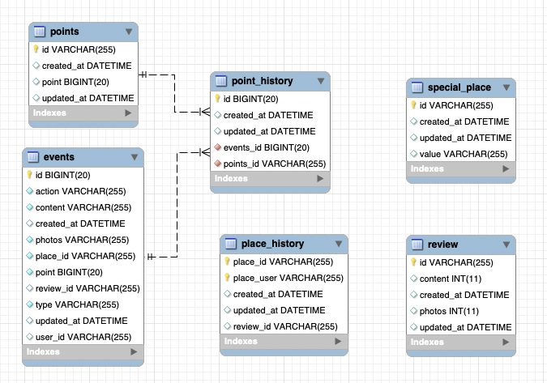
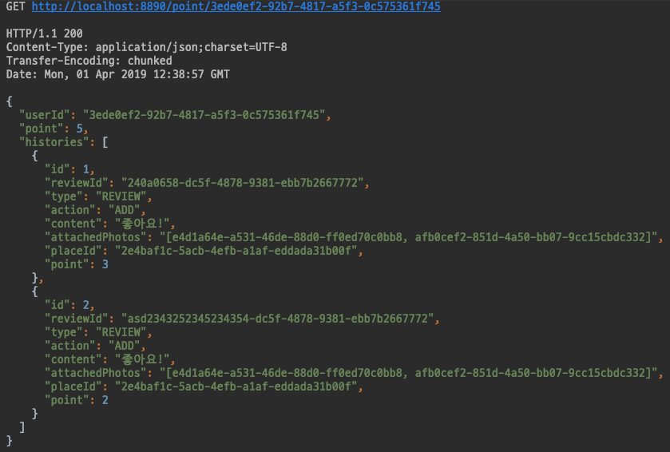
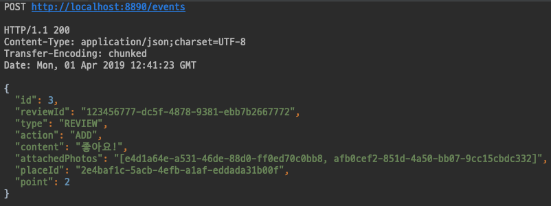
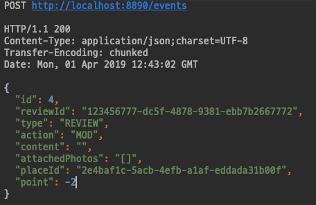
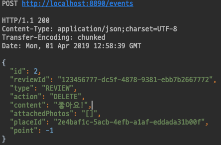

# 클럽 마일리지 서비스

# 목차
- [0. 요구사항](#0.-요구사항)
- [1. 프로젝트 환경](#1.-프로젝트-환경)
- [2. 기능정의](#2.-기능정의)
  * [기능 구현](#기능-구현)
- [3. 데이터베이스 설계](#3.-데이터베이스-설계)
- [4. API 정보](#4.-api-정보)
  - [API 목록](#API-목록)
- [5. 문제 해결방안 및 시나리오](#5.-문제-해결방안-및-시나리오)
  * [문제해결](#문제해결)
  * [시나리오](#시나리오)

# 0. 요구사항
## SPECIFICATIONS
리뷰 작성이 이뤄질 때마다 리뷰 작성 이벤트가 발생하고, 아래 API로 이벤트를 전달합니다.
```json
    POST /events
    { 
    	"type": "REVIEW", "action": "ADD", /* "MOD", "DELETE" */ 
    	"reviewId": "240a0658-dc5f-4878-9381-ebb7b2667772", 
    	"content": "좋아요!", 
    	"attachedPhotoIds": ["e4d1a64e-a531-46de-88d0-ff0ed70c0bb8", "afb0cef2-851d-4a50-bb07-9cc15cbdc332"], 
    	"userId": "3ede0ef2-92b7-4817-a5f3-0c575361f745", 
    	"placeId": "2e4baf1c-5acb-4efb-a1af-eddada31b00f"
    }
```
한 사용자는 장소마다 리뷰를 1개만 작성할 수 있고, 리뷰는 수정 또는 삭제할 수 있습니다. 리뷰 작성 보상 점수는 아래와 같습니다.

- 내용 점수
    - 1자 이상 텍스트 작성: 1점
    - 1장 이상 사진 첨부: 1점
- 보너스 점수
    - 특정 장소에 첫 리뷰 작성: 1점

## REQUIREMENTS
- 이 서비스를 위한 SQL(MySQL 5.7) 스키마를 설계해 주세요. 테이블과 인덱스에 대한 DDL이 필요합니다.
- 아래에 대한 pseudo code를 작성해 주세요.
    - 포인트 적립 API
    - 포인트 조회 API

## 비고
- 포인트 증감이 있을 때마다 이력이 남아야 합니다.
- 포인트 부여 API 구현에 필요한 SQL 수행 시, 전체 테이블 스캔이 일어나지 않는 인덱스가 필요합니다.
- 사용자마다 현재 시점의 포인트 총점을 조회하거나 계산할 수 있어야 합니다.
- 리뷰를 작성했다가 삭제하면 해당 리뷰로 부여한 내용 점수와 보너스 점수는 회수합니다.
- 리뷰를 수정하면 수정한 내용에 맞는 내용 점수를 계산하여 점수를 부여하거나 회수합니다.
    - 글만 작성한 리뷰에 사진을 추가하면 1점을 부여합니다.
    - 글과 사진이 있는 리뷰에서 사진을 모두 삭제하면 1점을 회수합니다.
- 사용자 입장에서 본 '첫 리뷰'일 때 보너스 점수를 부여합니다.
    - 어떤 장소에 사용자 A가 리뷰를 남겼다가 삭제하고, 삭제 된 이후 사용자 B가 리뷰를 남기면 사용자 B에게 보너스 점수를 부여합니다.
    - 어떤 장소에 사용자 A가 리뷰를 남겼다가 삭제하는데, 삭제 되기 이전 사용자 B가 리뷰를 남기면 사용자 B에게 보너스 점수를 부여하지 않습니다.

# 1. 프로젝트 환경
- 백엔드
  - Spring Boot
  - Spring Data JPA
  - JAVA 8
  - Lombock
  - Mysql 5.7(Database)

# 2. 기능정의
## 기능 구현
- [x] 사용자는 리뷰를 작성할 수 있다.
- [x] 사용자는 현재시점의 포인트 총점을 조회, 계산할 수 있다.
  - 내용점수
    - [X] 1자 이상 텍스트 작성 : `+1`
    - [x] 1장 이상 사진 첨부 : `+1`
  - 보너스 점수
    - [x] 특정 장소에 첫 리뷰 작성 시 : `+1`
- [x] 사용자는 리뷰를 삭제, 수정시 얻었던 마일리지를 삭감당하게된다.
  - 수정
    - [x] 사진 추가 / 삭제 : `+1 / -1`
  - 삭제
    - [x] 글 삭제 : 기본 `-1` / 사진포함 `-1` / 첫 리뷰 `-1`
## pseudo code
- 포인트 적립
```text
begin

end
```
- 포인트 조회
```text

```

# 3. 데이터베이스 설계
## 테이블 설계
- [Table DDL](/ddl.sql)
- `points` : 사용자 id와 해당유저의 현재 포인트를 가짐
- `events` : `/events`의 결과를 저장
- `review` : 리뷰id를 키로 가지고 있으며 해당 리뷰의 현재 상태를 정규화 해놓은 테이블
- `special_place` : 첫리뷰 조건을 구현하기위해 특정 place를 미리 지정해놓은 테이블
- `point_history` : `points`와 `events`를 다대일 관계로 연관되어있음.
- `place_history` : `place_id`와 `place_user`를 복합키로 가지고 있으며, 유저가 해당 장소에 리뷰를 작성했는지 판단하기위한 테이블


# 4. API 정보
## API 목록
Method|URL|description
-|-|-
POST|/events|리뷰 작성, 수정, 삭제 (action: `ADD`, `DELETE`, `MOD`)
GET|/point/{user_id}|사용자 포인트, 포인트증감이벤트 확인


# 5. 문제 해결방안 및 시나리오
## 문제해결
- 같은 도메인의 `request`에서 action (ADD,MOD,DELETE) 세가지로 나누어 로직을 처리해야해서 팩토리 메소드 패턴을 적용하여 추상화단계를 높임
- `events` 테이블과 `points` 테이블이 `point_history` 테이블과 일대다 관계를 맺어 해당 `event_id`가 어느 유저의 포인트를 얼마나 적립, 차감을 했는지 알 수 있음.
- 
## 시나리오
1. 사용자는 `userId`로 `point`와 증감내역을 알 수 있다. (GET - /point/{id})
   -  
2. 사용자는 리뷰를 작성할 수 있다. (POST - /events)
   - Action : `ADD`
   - 사진 유무, 본문 글의 유무, 첫 리뷰 유무로 총 `3점`까지 얻을 수 있다.
   - 
3. 사용자는 리뷰를 수정할 수 있다. (POST - /events)
   - Action : `MOD`
   - 이미 작성한 리뷰내용을 수정할 수 있으며 얻었던 점수를 차감당할 수 있다.
   - 
4. 사용자는 리뷰를 삭제할 수 있다. (POST - /events)
   - Action : `DELETE`
   - 해당 리뷰가 사용자에게 부여한 점수만큼 차감시키고, 리뷰는 삭제된다.
   - 
